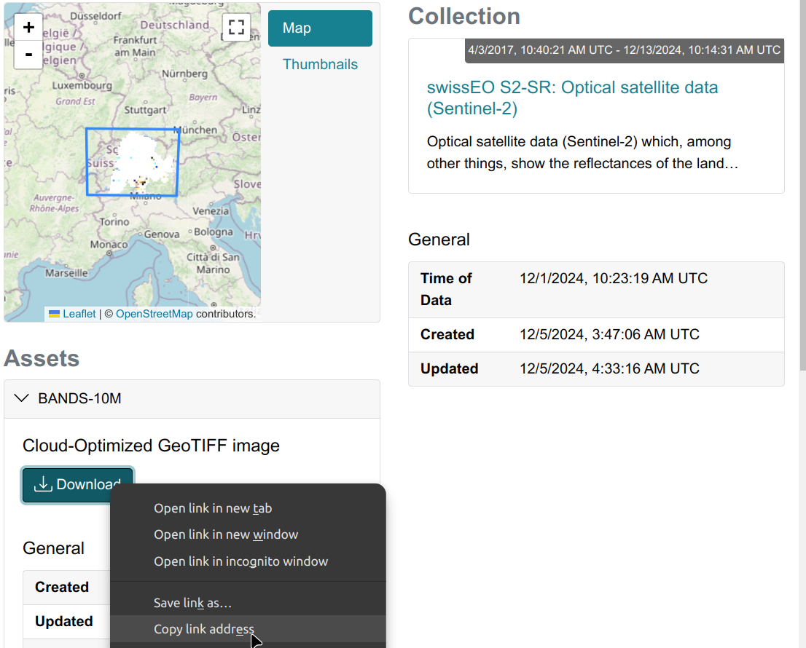
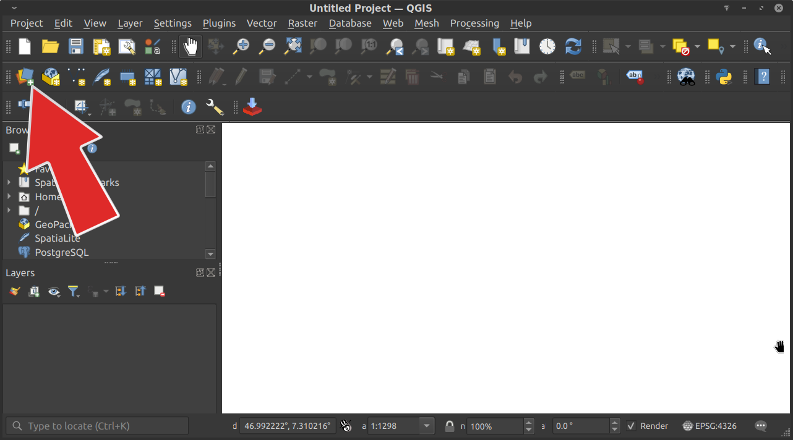
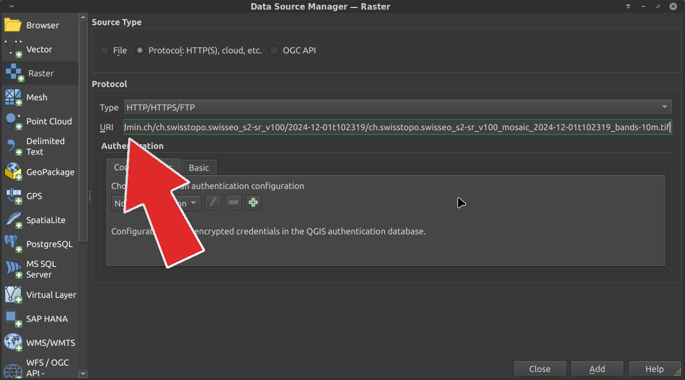
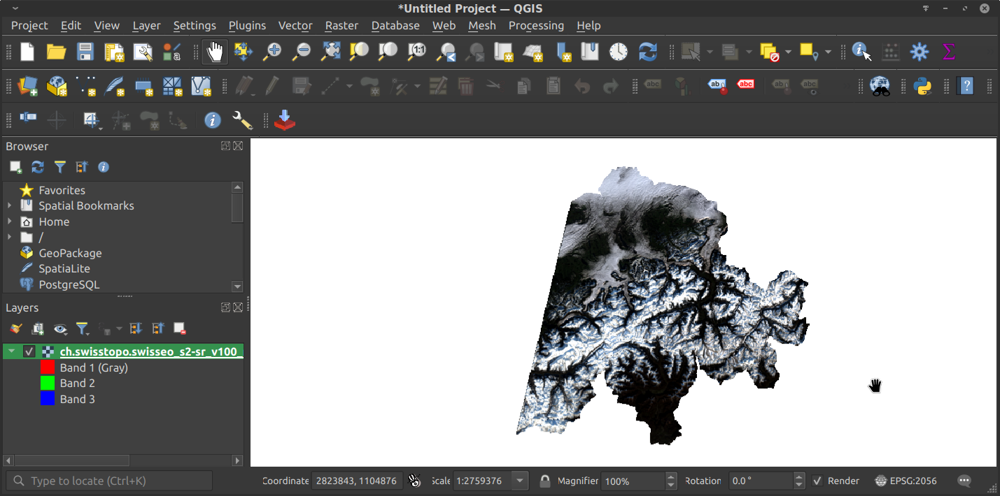
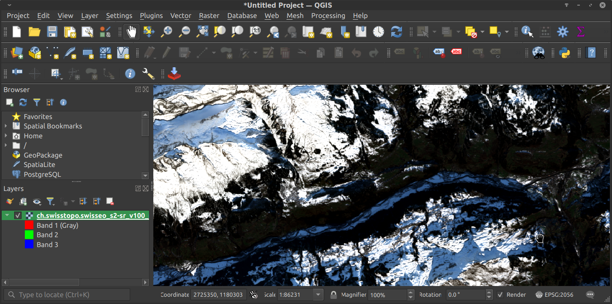

# Access <em>SwissEO</em> in QGIS 

   
 
<b>Abstract.</b> This tutorial will show you how to read a <em>SwissEO</em> Raster data (Cloud Optimized GeoTIFF (COG)) in QGIS- streaming straight from its online location instead of downloading it.
 

Finding data
---------------------

To find your SwissEO data as Cloud Optimized GeoTIFF:

1. **Select collection in the STAC Browser**  
   Open for `SwissEO S2-SR` [https://data.geo.admin.ch/browser/index.html#/collections/ch.swisstopo.swisseo_s2-sr_v100](https://data.geo.admin.ch/browser/index.html#/collections/ch.swisstopo.swisseo_s2-sr_v100) respectively for `SwissEO VHI` [https://data.geo.admin.ch/browser/index.html#/collections/ch.swisstopo.swisseo_vhi_v100](https://data.geo.admin.ch/browser/index.html#/collections/ch.swisstopo.swisseo_vhi_v100).

2. **Refine Search**  
   - Use the map interface to select your area of interest.  
   - Adjust date range filters.  
   - Click on desired items to view details.

4. **Retrieve Cloud Optimized GeoTIFF (COG)**  
   - Right-click on the desired asset link (e.g., `bands-10m.tif`).  
   - Select "Copy link address":

   

   - This will copy the link you need to your clipboard. You can paste this into a scratch pad document to use later, or you can just not copy anything else and use it in our next step in QGIS.

 

Loading Cloud Optimized GeoTIFF in QGIS
-------------------

Open the _Data source manager_ click the icon.

In the _Data source manager Browser_ choose the 'Raster' dialog and select 'Protocol: HTTP(S), cloud, etc.'. In the protocol dialog, select Type 'HTTP/HTTPS/FTP' and paste the URL from the link location (in this case from the image of the data.geo.admin.ch STAC Browser).

 
Click 'Add' and when the COG is loaded into QGIS, close the _Data source manager_. 
 

Cloud Optimized GeoTIFF versus local geotiff file
-----------------------------

Admittedly this looks about the same as downloading and using a GeoTIFF locally. But the power of the Cloud Optimized GeoTIFF becomes apparent when you zoom in. On fast connections it should take less than a second to redraw, at full resolutions. This is a little slower than downloading the whole file and loading it up locally.

 

So you can try to hit the download button from OpenAerialMap to compare the performance. But what you’ll find there is a 500 MB  file that takes quite awhile to download on all but the fastest connections. The advantage of using the Cloud Optimized GeoTIFF is that you can zoom to anywhere within seconds, instead of waiting for a huge GeoTIFF to download. This access pattern saves everyone time and money, by getting to people only the data they need to do their task. And it enables access to fully analytic data, not just the visualization that web tiles allow.

<small><b>Acknowledgments</b>:
This tutorial was inspired by  [COGEO](https://cogeo.org/qgis-tutorial.html). Special thanks to their open-source contributions and educational resources that helped shape this tutorial.</small>